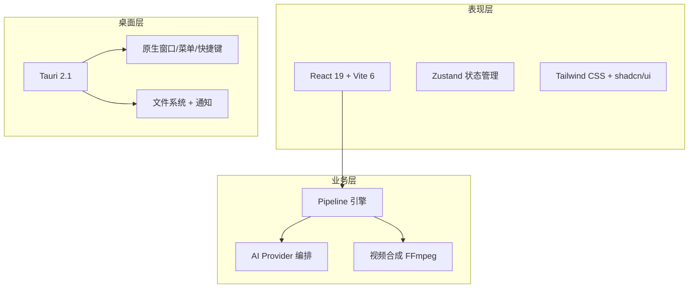

# 架构设计

> Story Weaver v3 分层架构与设计决策

## 系统架构



## 分层架构

```
┌──────────────────────────────────────────────────────┐
│  pages/              Page components (route shells)   │
│  features/           Vertical feature slices          │
│  components/         Legacy domain UI components      │
├──────────────────────────────────────────────────────┤
│  core/               Business logic, pure, no React   │
│  infrastructure/     External system adapters         │
├──────────────────────────────────────────────────────┤
│  shared/             Base: UI primitives, types, utils│
└──────────────────────────────────────────────────────┘
```

**依赖方向**: UI → core → shared（单向，无反向）

## 技术栈

| 层   | 技术                   | 版本     |
| ---- | ---------------------- | -------- |
| 前端 | React + TypeScript     | 19 + 5.4 |
| 构建 | Vite                   | 6        |
| CSS  | Tailwind CSS           | 4        |
| 桌面 | Tauri                  | 2.1      |
| 后端 | Rust + FFmpeg          | 最新     |
| 测试 | Jest + Testing Library | 30+      |
| 状态 | Zustand                | 4        |
| 包管理 | pnpm                | workspace |

## 设计决策

### Symbol-keyed Pipeline 上下文

```typescript
export const CONTEXT_KEY: unique symbol = Symbol('PipelineContext');

export interface StepInput {
  [key: string]: unknown;
  [CONTEXT_KEY]?: PipelineContext; // 非枚举挂载，避免与步骤数据冲突
}
```

使用 Symbol 作为 Context 的挂载键，避免步骤返回值覆盖上下文。

### 双模 AI Provider

```typescript
export abstract class BaseAIProviderStrategy {
  abstract readonly name: string;
  abstract call(apiKey: string, config: AIRequestConfig): Promise<AIResponse>;
}

// OpenAI 兼容协议（OpenAI/Alibaba/Zhipu）
export abstract class OpenAICompatibleStrategy extends BaseAIProviderStrategy { ... }
```

7 Provider 共享同一接口，OpenAI 兼容协议封装为抽象基类消除重复。

## 已废弃的路径（清理完成）

以下路径已完全删除，旧导入将无法解析：

| 已删除路径 | 迁移到 | 说明 |
|----------|--------|------|
| `@/services/` | `@/core/services/` | 服务层 facade 已删除，改用核心路径 |
| `@/types/` | `@/shared/types/` | 旧类型目录已完全删除，21 个导入方已迁移 |
| `@/shared/utils/general.ts` | `@/shared/utils/` | 已删除，barrel 直接导出子模块 |

以下路径保留导出且标记 `@deprecated`，新代码请使用推荐路径：

| 废弃路径 | 推荐路径 | 说明 |
|----------|----------|------|
| `@/core/services/pipeline/pipeline-types.ts` | `@/core/pipeline/pipeline-types.ts` | 服务层类型 shim，不兼容核心版本 |

## 重构进度

### Phase 1: 安全清理（已完成）
- 删除 `infrastructure/ai/providers/` 废弃目录
- 删除 `shared/utils/general.ts` barrel，改为直接导出
- 清理 10+ 文件中的子模块合并注释块死代码
- 统一 `uuid`/`uuidv4` 导入命名（20 文件）
- 集中 localStorage key 到 `core/constants/app-config.ts` `STORAGE_KEYS`
- 标记 `core/services/pipeline/pipeline-types.ts` shim 为 `@deprecated`
- 重命名 `createExportStep` 冲突 → `createSimpleExportStep`

### Phase 2: 消除重复（已完成）
- 合并重复的 StepActions 组件（删除本地副本）
- 标记 shared logger 为 `@deprecated`
- 统一所有 toast 导入路径到 `@/shared/components/ui/toast`
- 提取 reducer 公共模式（useProject + useVideo 改用 `createFieldUpdater`）

### Phase 3: 架构升级（已完成）
- 删除纯 re-export facade（PipelineFacade, AIProviderRegistry, FFmpegService）
- 删除 `src/types/` 旧类型目录，21 个导入方迁移到 `@/shared/types/`
- 大文件拆分：ProjectEditContext（554→180）、video-analysis-service（574→134）、project-import-export-service（535→170）
- CI 修复：TS 构建错误、Vite build 缺失模块文件、E2E 测试
- 清理 stale dev artifacts（docs/superpowers、.superpowers/sdd、.zcode/plans、.workbuddy/memory）
- 统一 `package.json` 脚本使用 `pnpm` 而非 `npm`

[下一步：模块系统 →](/developer-guide/module-system)
